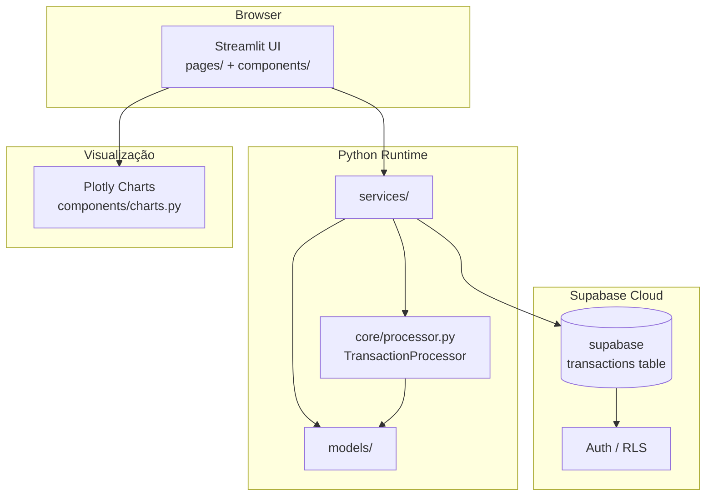
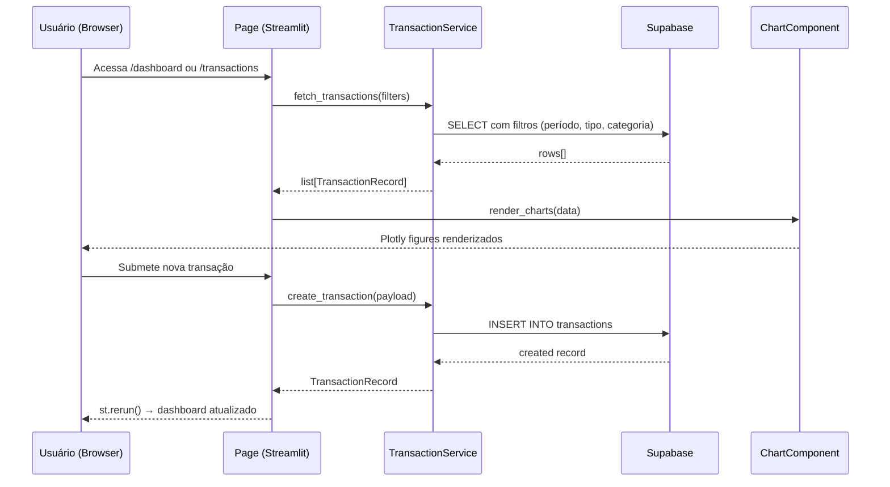

# Design Document: Financial Dashboard

## Overview

Dashboard financeiro interativo construído com Streamlit, Plotly e Supabase, evoluindo o FluxCash de uma aplicação desktop PySide6 para uma interface web moderna. O sistema reutiliza os modelos de domínio existentes (`Transaction`, `Summary`, `TransactionProcessor`) e adiciona persistência em nuvem via Supabase, visualizações ricas com Plotly e um design system dark/neon configurado via `.streamlit/config.toml` e `styles.py`.

O dashboard cobre três dimensões financeiras — receitas, despesas e investimentos — com filtros por período, categorias interativas e KPIs em tempo real.

---

## Arquitetura (High-Level)



### Camadas

| Camada | Responsabilidade | Tecnologia |
|---|---|---|
| `pages/` | Roteamento de páginas Streamlit | Streamlit multi-page |
| `components/` | Widgets reutilizáveis (cards, charts, forms) | Streamlit + Plotly |
| `services/` | Acesso a dados, lógica de negócio | supabase-py |
| `models/` | Schemas Pydantic para validação e tipagem | Pydantic v2 |
| `core/` | Motor de categorização (existente) | Python puro |
| `.streamlit/` | Configuração de tema e servidor | Streamlit config |

---

## Fluxo de Dados



---

## Componentes e Interfaces (High-Level)

### `services/transaction_service.py`

**Propósito**: Abstrai todas as operações CRUD no Supabase e aplica a lógica de categorização do `TransactionProcessor`.

```python
class TransactionService:
    def fetch_transactions(
        self,
        start_date: date | None = None,
        end_date: date | None = None,
        transaction_type: str | None = None,
        category: str | None = None,
    ) -> list[TransactionRecord]: ...

    def create_transaction(self, payload: TransactionCreate) -> TransactionRecord: ...

    def delete_transaction(self, transaction_id: str) -> None: ...

    def fetch_summary(
        self,
        start_date: date | None = None,
        end_date: date | None = None,
    ) -> DashboardSummary: ...
```

**Responsabilidades**:
- Conectar ao Supabase via `supabase-py`
- Aplicar `TransactionProcessor.categorize()` em transações sem categoria
- Calcular `DashboardSummary` (totais, saldo, breakdown por categoria)
- Cachear resultados com `@st.cache_data(ttl=60)`

---

### `components/charts.py`

**Propósito**: Funções puras que recebem dados e retornam `plotly.graph_objects.Figure`.

```python
def income_expense_bar(data: list[TransactionRecord]) -> go.Figure: ...
def expense_donut(data: list[TransactionRecord]) -> go.Figure: ...
def investment_timeline(data: list[TransactionRecord]) -> go.Figure: ...
def balance_trend(data: list[TransactionRecord]) -> go.Figure: ...
```

**Responsabilidades**:
- Aplicar paleta de cores do `styles.py` (PRIMARY, INCOME, EXPENSE, INVESTMENT)
- Retornar figuras com layout dark (`paper_bgcolor`, `plot_bgcolor` = `#0d1117`)
- Sem efeitos colaterais — apenas transformação de dados em figura

---

### `components/kpi_cards.py`

**Propósito**: Renderiza os cards de KPI no topo do dashboard.

```python
def render_kpi_row(summary: DashboardSummary) -> None: ...
def kpi_card(label: str, value: float, delta: float | None, color: str) -> None: ...
```

---

### `components/transaction_form.py`

**Propósito**: Formulário de entrada de nova transação com validação inline.

```python
def render_transaction_form(service: TransactionService) -> TransactionCreate | None: ...
```

---

### `pages/`

| Arquivo | Rota | Conteúdo |
|---|---|---|
| `app.py` | `/` (entry point) | Inicialização, config Supabase, sidebar |
| `pages/1_dashboard.py` | `/dashboard` | KPIs + 4 gráficos principais |
| `pages/2_transactions.py` | `/transactions` | Tabela filtrável + formulário de entrada |
| `pages/3_investments.py` | `/investments` | Timeline de investimentos + breakdown Individual/Conjunto |

---

## Modelos de Dados (High-Level)

### Esquema Supabase — tabela `transactions`

```sql
CREATE TABLE transactions (
    id          UUID PRIMARY KEY DEFAULT gen_random_uuid(),
    value       NUMERIC(12, 2)  NOT NULL CHECK (value > 0),
    description TEXT            NOT NULL,
    category    TEXT            NOT NULL DEFAULT 'Outros',
    type        TEXT            NOT NULL CHECK (type IN ('receita', 'despesa')),
    investment_type TEXT        NOT NULL DEFAULT 'N/A'
                                CHECK (investment_type IN ('Individual', 'Conjunto', 'N/A')),
    timestamp   TIMESTAMPTZ     NOT NULL DEFAULT now(),
    user_id     UUID            REFERENCES auth.users(id) ON DELETE CASCADE
);

CREATE INDEX idx_transactions_timestamp ON transactions (timestamp DESC);
CREATE INDEX idx_transactions_type      ON transactions (type);
CREATE INDEX idx_transactions_user      ON transactions (user_id);
```

### Modelos Pydantic (`models/schemas.py`)

```python
from pydantic import BaseModel, Field
from datetime import datetime
from uuid import UUID

class TransactionCreate(BaseModel):
    value: float = Field(gt=0)
    description: str = Field(min_length=1, max_length=200)
    category: str = "Outros"
    type: Literal["receita", "despesa"]
    investment_type: Literal["Individual", "Conjunto", "N/A"] = "N/A"

class TransactionRecord(TransactionCreate):
    id: UUID
    timestamp: datetime
    user_id: UUID | None = None

class DashboardSummary(BaseModel):
    total_income: float
    total_expense: float
    balance: float
    total_investment: float
    expense_by_category: dict[str, float]
    income_by_category: dict[str, float]
    period_start: date | None
    period_end: date | None
```

---

## Design System e Estilos

### `.streamlit/config.toml`

```toml
[theme]
base            = "dark"
primaryColor    = "#4ade80"
backgroundColor = "#0d1117"
secondaryBackgroundColor = "#161b22"
textColor       = "#e6edf3"
font            = "sans serif"

[server]
headless = true
port     = 8501
```

### `styles.py` — Paleta OKLCH → HEX

```python
PRIMARY    = "#4ade80"  # Mint     — ações primárias, destaques
INCOME     = "#22c55e"  # Verde    — receitas
EXPENSE    = "#f87171"  # Coral    — despesas
INVESTMENT = "#fbbf24"  # Âmbar   — investimentos
NEUTRAL    = "#8b949e"  # Muted    — textos secundários
BG_DARK    = "#0d1117"  # Base     — fundo principal
BG_CARD    = "#161b22"  # Card     — fundo de cards
```

---

## Estrutura de Arquivos (Low-Level)

```
financial-dashboard/          # ou integrado em fluxcash/
├── app.py                    # Entry point: st.set_page_config + sidebar
├── styles.py                 # Paleta de cores OKLCH→HEX
├── .streamlit/
│   └── config.toml           # Tema dark + configurações do servidor
├── pages/
│   ├── 1_dashboard.py        # Visão geral: KPIs + gráficos
│   ├── 2_transactions.py     # CRUD de transações
│   └── 3_investments.py      # Análise de investimentos
├── components/
│   ├── __init__.py
│   ├── charts.py             # Funções Plotly puras
│   ├── kpi_cards.py          # Cards de métricas
│   └── transaction_form.py   # Formulário de entrada
├── services/
│   ├── __init__.py
│   ├── supabase_client.py    # Singleton do cliente Supabase
│   └── transaction_service.py
├── models/
│   ├── __init__.py
│   └── schemas.py            # Pydantic models
└── core/                     # Reutilizado do FluxCash existente
    ├── models.py
    └── processor.py
```

---

## Assinaturas de Funções Principais (Low-Level)

### `services/supabase_client.py`

```python
from supabase import create_client, Client
import streamlit as st

@st.cache_resource
def get_supabase() -> Client:
    """
    Retorna singleton do cliente Supabase.
    Lê SUPABASE_URL e SUPABASE_KEY de st.secrets ou variáveis de ambiente.
    
    Precondições:
      - SUPABASE_URL e SUPABASE_KEY definidos em .streamlit/secrets.toml
    Pós-condições:
      - Retorna Client autenticado e reutilizável entre reruns
    """
    url: str = st.secrets["SUPABASE_URL"]
    key: str = st.secrets["SUPABASE_KEY"]
    return create_client(url, key)
```

### `services/transaction_service.py`

```python
from datetime import date
from supabase import Client
from models.schemas import TransactionCreate, TransactionRecord, DashboardSummary
from core.processor import TransactionProcessor
import streamlit as st

class TransactionService:
    def __init__(self, client: Client) -> None:
        self._db = client
        self._processor = TransactionProcessor()

    @st.cache_data(ttl=60)
    def fetch_transactions(
        _self,
        start_date: date | None = None,
        end_date: date | None = None,
        transaction_type: str | None = None,
        category: str | None = None,
    ) -> list[TransactionRecord]:
        """
        Busca transações com filtros opcionais.
        
        Precondições:
          - start_date <= end_date se ambos fornecidos
        Pós-condições:
          - Retorna lista ordenada por timestamp DESC
          - Lista vazia se nenhum resultado
        """
        ...

    def create_transaction(self, payload: TransactionCreate) -> TransactionRecord:
        """
        Persiste nova transação. Aplica categorização automática se
        payload.category == 'Outros'.
        
        Precondições:
          - payload.value > 0
          - payload.description não vazio
        Pós-condições:
          - Registro inserido no Supabase com id e timestamp gerados
          - Cache invalidado via st.cache_data.clear()
        """
        ...

    def delete_transaction(self, transaction_id: str) -> None:
        """
        Remove transação por ID.
        
        Pós-condições:
          - Registro removido do Supabase
          - Cache invalidado
        """
        ...

    def fetch_summary(
        _self,
        start_date: date | None = None,
        end_date: date | None = None,
    ) -> DashboardSummary:
        """
        Agrega totais para o período.
        
        Pós-condições:
          - balance == total_income - total_expense
          - sum(expense_by_category.values()) == total_expense
        """
        ...
```

### `components/charts.py`

```python
import plotly.graph_objects as go
import plotly.express as px
from models.schemas import TransactionRecord
from styles import INCOME, EXPENSE, INVESTMENT, BG_DARK, BG_CARD

_LAYOUT_BASE = dict(
    paper_bgcolor=BG_DARK,
    plot_bgcolor=BG_CARD,
    font=dict(color="#e6edf3"),
    margin=dict(l=16, r=16, t=32, b=16),
)

def income_expense_bar(
    data: list[TransactionRecord],
    group_by: str = "month",
) -> go.Figure:
    """
    Gráfico de barras agrupadas: receitas vs despesas por período.
    
    Parâmetros:
      - group_by: 'month' | 'week' | 'day'
    Pós-condições:
      - Barras de receita em INCOME (#22c55e)
      - Barras de despesa em EXPENSE (#f87171)
    """
    ...

def expense_donut(data: list[TransactionRecord]) -> go.Figure:
    """
    Donut chart de despesas por categoria.
    
    Pós-condições:
      - Cada fatia representa uma categoria
      - Percentual exibido no hover
    """
    ...

def investment_timeline(data: list[TransactionRecord]) -> go.Figure:
    """
    Linha do tempo de aportes de investimento.
    
    Pós-condições:
      - Linha em INVESTMENT (#fbbf24)
      - Diferencia Individual vs Conjunto por marcador
    """
    ...

def balance_trend(data: list[TransactionRecord]) -> go.Figure:
    """
    Área acumulada do saldo ao longo do tempo.
    
    Pós-condições:
      - Área preenchida em PRIMARY (#4ade80) com opacidade 0.3
      - Linha sólida em PRIMARY
    """
    ...
```

### `pages/1_dashboard.py`

```python
import streamlit as st
from services.supabase_client import get_supabase
from services.transaction_service import TransactionService
from components.kpi_cards import render_kpi_row
from components.charts import (
    income_expense_bar,
    expense_donut,
    investment_timeline,
    balance_trend,
)

def render_filters() -> tuple[date | None, date | None]:
    """Renderiza sidebar com filtros de período. Retorna (start, end)."""
    ...

def main() -> None:
    st.set_page_config(page_title="FluxCash · Dashboard", layout="wide")
    
    service = TransactionService(get_supabase())
    start, end = render_filters()
    
    summary = service.fetch_summary(start, end)
    transactions = service.fetch_transactions(start, end)
    
    render_kpi_row(summary)
    
    col1, col2 = st.columns(2)
    with col1:
        st.plotly_chart(income_expense_bar(transactions), use_container_width=True)
    with col2:
        st.plotly_chart(expense_donut(transactions), use_container_width=True)
    
    col3, col4 = st.columns(2)
    with col3:
        st.plotly_chart(balance_trend(transactions), use_container_width=True)
    with col4:
        st.plotly_chart(investment_timeline(transactions), use_container_width=True)

if __name__ == "__main__":
    main()
```

---

## Tratamento de Erros

### Falha de conexão com Supabase

**Condição**: `SUPABASE_URL` ou `SUPABASE_KEY` ausentes, ou timeout de rede.  
**Resposta**: `st.error("Não foi possível conectar ao banco de dados.")` + `st.stop()`  
**Recuperação**: Usuário verifica `.streamlit/secrets.toml` e recarrega a página.

### Validação de formulário

**Condição**: `value <= 0` ou `description` vazio.  
**Resposta**: `st.warning()` inline no formulário, sem submissão.  
**Recuperação**: Usuário corrige os campos.

### Dados vazios

**Condição**: Nenhuma transação no período selecionado.  
**Resposta**: `st.info("Nenhuma transação encontrada para o período.")` + gráficos com estado vazio.  
**Recuperação**: Usuário ajusta filtros ou adiciona transações.

---

## Estratégia de Testes

### Testes Unitários

- `TransactionService.fetch_summary()`: verificar invariante `balance == income - expense`
- `TransactionProcessor.categorize()`: cobrir todas as categorias do `CATEGORY_MAP`
- Funções de chart: verificar que retornam `go.Figure` com cores corretas

### Testes Baseados em Propriedades

**Biblioteca**: `hypothesis`

```python
from hypothesis import given, strategies as st

@given(st.lists(st.floats(min_value=0.01, max_value=1e6)))
def test_summary_balance_invariant(values):
    # Para qualquer lista de transações, balance == income - expense
    ...

@given(st.text(min_size=1))
def test_categorize_always_returns_valid_category(description):
    result = processor.categorize(description)
    assert result in TransactionProcessor.CATEGORY_MAP
```

### Testes de Integração

- Supabase: usar projeto de teste separado ou mock via `pytest-mock`
- Streamlit: `streamlit.testing.v1.AppTest` para testar fluxo de páginas

---

## Considerações de Performance

- `@st.cache_data(ttl=60)` em todas as queries ao Supabase para evitar round-trips desnecessários
- `@st.cache_resource` no cliente Supabase (singleton por sessão)
- Paginação na tabela de transações: carregar máximo 500 registros por vez
- Índices no Supabase em `timestamp`, `type` e `user_id`

## Considerações de Segurança

- Credenciais Supabase exclusivamente em `.streamlit/secrets.toml` (nunca em código)
- Row Level Security (RLS) habilitado na tabela `transactions` — cada usuário acessa apenas seus dados
- Validação de entrada via Pydantic antes de qualquer INSERT
- `.streamlit/secrets.toml` adicionado ao `.gitignore`

## Dependências

```toml
# pyproject.toml — adicionar ao projeto existente
[project.optional-dependencies]
dashboard = [
    "streamlit>=1.35",
    "plotly>=5.22",
    "supabase>=2.4",
    "pydantic>=2.7",
    "pandas>=2.2",       # para manipulação de dados nos charts
    "python-dotenv>=1.0",
]
```
